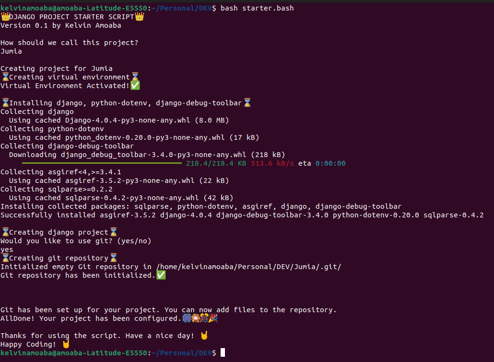

# django-starter
This is a bash script to speed up the process of creating a new django projects. You'll find this very useful.💥
This script creates a new django project with the following features:
- A new virtual environment with installed django and all the dependencies.
- A new git repository (which you can decide whether to use).
- A new django project with using the template structure of Audrey Roy Greenfeld and Daniel Roy Greenfeld (Two Scoops of Django).

## Usage
```bash
$ bash starter.sh 
```

## Preinstalled packages
- [Django](https://www.djangoproject.com/download/)
- [django-debug-toolbar](https://django-debug-toolbar.readthedocs.io/en/latest/)
- [python-dotenv](https://pypi.org/project/python-dotenv/)

## Directory structure
- `Project Name`
    - `manage.py`
    - `README.md`
    - `requirements.txt`
    - `static/`
        - `style.css`
    - `templates/`
        - `index.html`
    - `ProjectName/`
        - `asgi.py`
        - `__init__.py`
        - `settings/`
            - `__init__.py`
            - `base.py`
            - `local.py`
            - `production.py`
        - `urls.py`
        - `wsgi.py`
    - `.gitignore`
    - `venv/`
        

## [Contributing](https://github.com/AmoabaKelvin/django-starter)

If you have any questions, or would like to contribute, please open an issue or create a pull request.

If you are looking for a specific feature, please open an issue or create a pull request.

If you like this project, please give it a star: [GitHub](https://github.com/AmoabaKelvin/django-starter)


## License
GNU General Public License v3.0


## Version
0.1.0


## Author
[AmoabaKelvin](https://github.com/AmoabaKelvin)


## Sample Image
